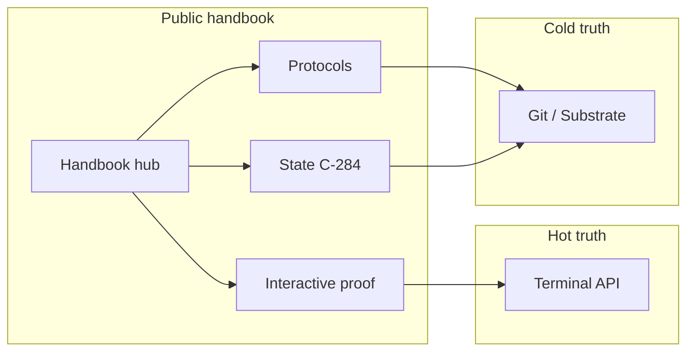

# Mobius Handbook

**Cycle:** C-284 · **Audience:** public readers, operators, contributors

This is the **current** handbook entry for the GitHub Pages site. It ties the cold archive (this repo) to the **hot** [Mobius Civic AI Terminal](https://mobius-civic-ai-terminal.vercel.app/) so claims stay checkable.

---

## Start here (5 minutes)

| Step | Link |
|------|------|
| 1. Orientation | [Start Here](../../00-START-HERE/README.md) |
| 2. What exists now | [State of the Substrate (C-284)](../../STATE_OF_THE_SUBSTRATE_C-284.md) |
| 3. Canonical protocols | Use **Protocols** in the site nav (Vault v1/v2, Agent Reporting, Tripwires) |
| 4. How live proof works | [Interactive library](./interactive-library.md) |

---

## Live snapshot (from Terminal)

  <mobius-proof endpoint="snapshot-lite" path="integrity.gi" label="GI"></mobius-proof>
  <mobius-proof endpoint="snapshot-lite" path="integrity.mode" label="Mode"></mobius-proof>
  <mobius-proof endpoint="vault-status" path="in_progress_balance" label="Vault in progress"></mobius-proof>

Values load from `snapshot-lite` and `vault/status` when CORS allows this origin. Narrative in docs remains canonical if live data is unavailable.

---

## Handbook map

---

## Archived editions

The **Kaizen-OS Founder's Handbook (November 2025)** is preserved for history and moved to **[10-ARCHIVES/handbook/kaizen-os-2025](../../10-ARCHIVES/handbook/kaizen-os-2025/index.md)**. It predates the Terminal-first architecture; use it for narrative context, not API truth.

---

## For contributors

- [Proof tags authoring](./proof-tags-authoring.md) — embed `<mobius-proof>` in Markdown
- [Documentation index](../../INDEX.md) — full doc map
- [Substrate repository](https://github.com/kaizencycle/Mobius-Substrate) · [Terminal repository](https://github.com/kaizencycle/mobius-civic-ai-terminal)

---

*"We heal as we walk." — Mobius Substrate*
