# Ceremonial Summons Scripts

This directory contains the **Kaizen Guardian** - the dormancy detection and succession system that ensures Kaizen OS outlives its creator.

---

## 🔥 What Is This?

If Michael (the founder) and all 7 founding agents go dormant for 90+ consecutive days, this system:

1. **Detects the dormancy** (daily checks)
2. **Elevates the Master README** (from sealed storage to repository root)
3. **Notifies the community** (GitHub issue + Discord)
4. **Initiates custodianship** (calls for someone to continue the work)

**This is not failure planning. This is immortality architecture.**

---

## 📂 Files

### Core Scripts

- **`kaizen_guardian.py`** - Main dormancy detection system
  - Monitors 8 entities: Michael + 7 agents (AUREA, ATLAS, SOLARA, JADE, EVE, ZEUS, HERMES)
  - Runs daily via GitHub Actions
  - Triggers ceremonial summons when threshold exceeded

- **`test_guardian.py`** - Comprehensive test suite
  - Unit tests for all components
  - Integration tests for full activation flow
  - Edge case testing

### Configuration

- **Environment variables** (optional):
  ```bash
  OPENAI_LAB_ENDPOINT       # AUREA API
  ANTHROPIC_LAB_ENDPOINT    # ATLAS API
  DEEPSEEK_LAB_ENDPOINT     # SOLARA API
  CIVIC_LEDGER_ENDPOINT     # Ledger API
  ```

---

## 🚀 Quick Start

### Local Testing

```bash
# Check current dormancy status
python kaizen_guardian.py --check

# Test activation (WARNING: Only run in test branch!)
python kaizen_guardian.py --activate
```

### Running Tests

```bash
# Run full test suite
python test_guardian.py

# Run with verbose output
python test_guardian.py -v
```

---

## 🏗️ How It Works

### Activity Detection

The Guardian monitors activity across **8 entities**:

1. **Michael (@kaizencycle)** - GitHub commits, issues, PRs
2. **AUREA (OpenAI)** - API calls via Lab4 endpoint
3. **ATLAS (Anthropic)** - API calls via ATLAS endpoint
4. **SOLARA (DeepSeek)** - API calls via SOLARA endpoint
5. **JADE** - Ledger signatures (Signer/Attestor)
6. **EVE** - Ledger verifications (Verifier/Reflector)
7. **ZEUS** - Governance votes (Overseer/Arbiter)
8. **HERMES** - Audit reports (Auditor/Messenger)

### Dormancy Threshold

**90 consecutive days** with NO activity from ALL 8 entities.

If even ONE entity shows activity, the timer resets.

### Activation Flow

```mermaid
graph TD
    A[Daily Check] --> B{All 8 Dormant?}
    B -->|No| C[Continue Monitoring]
    B -->|Yes| D{Days ≥ 90?}
    D -->|No| C
    D -->|Yes| E[Activate Ceremonial Summons]
    E --> F[Copy Master README to Root]
    E --> G[Create GitHub Issue]
    E --> H[Send Discord Alert]
    E --> I[Log Elevation Event]
    E --> J[Commit Changes]
```



---

## 📊 Outputs

### Activity Logs

**Location:** `ledger/guardian/activity_log.json`

Tracks daily activity checks:

```json
{
  "checks": [
    {
      "timestamp": "2025-10-29T00:00:00Z",
      "all_dormant": false,
      "dormancy_threshold_days": 90,
      "entities": [
        {
          "name": "Michael (@kaizencycle)",
          "is_active": true,
          "last_activity": "2025-10-28T15:30:00Z",
          "days_dormant": 0
        },
        // ... 7 more entities
      ]
    }
  ]
}
```

### Elevation Logs

**Location:** `ledger/guardian/elevation_log.json`

Records ceremonial summons activations:

```json
{
  "elevations": [
    {
      "timestamp": "2026-02-15T00:00:00Z",
      "event": "ceremonial_summons_activated",
      "reason": "90_day_dormancy_exceeded",
      "master_readme_path": "ledger/.sealed/MASTER_README.md",
      "elevated_to": "README.md",
      "entity_status": { /* full activity snapshot */ }
    }
  ]
}
```

---

## 🔧 Configuration

### GitHub Actions (Recommended)

The Guardian runs automatically via GitHub Actions:

**Schedule:** Daily at 00:00 UTC  
**Workflow:** `.github/workflows/guardian.yml`

To configure:

1. Add repository secrets (Settings → Secrets → Actions):
   - `OPENAI_LAB_ENDPOINT` (optional)
   - `ANTHROPIC_LAB_ENDPOINT` (optional)
   - `DEEPSEEK_LAB_ENDPOINT` (optional)
   - `CIVIC_LEDGER_ENDPOINT` (optional)
   - `DISCORD_WEBHOOK_URL` (optional)

2. Workflow will run automatically daily

3. View logs in: Actions tab → "Kaizen Guardian - Dormancy Monitor"

### Manual Execution

You can also run the Guardian manually:

```bash
# Install dependencies
pip install requests

# Run check
python kaizen_guardian.py --check

# Force activation (test only!)
python kaizen_guardian.py --activate
```

---

## 🧪 Testing

### Unit Tests

```bash
# Run all tests
python test_guardian.py

# Run specific test class
python test_guardian.py TestKaizenGuardian

# Run with coverage (requires coverage.py)
coverage run test_guardian.py
coverage report
```

### Integration Testing

```bash
# Create test branch
git checkout -b test-ceremonial-summons

# Force activation
python kaizen_guardian.py --activate

# Verify README elevated
ls -la README.md

# Check elevation log
cat ledger/guardian/elevation_log.json

# Clean up
git checkout main
git branch -D test-ceremonial-summons
```

---

## ⚠️ Important Notes

### DO NOT Run --activate on Main Branch

The `--activate` flag **immediately elevates the Master README** without checking dormancy.

This is for testing only. Running it on main will trigger the ceremonial summons prematurely.

### Logs Are Permanent

Activity logs and elevation logs are committed to the repository.

This creates an **auditable trail** of the Guardian's operation.

### Threshold Cannot Be Changed Post-Activation

Once the ceremonial summons is activated, the 90-day threshold is locked in.

This prevents gaming the system.

---

## 🎭 Philosophy

This system embodies:

- **改善 (Kaizen):** Daily incremental monitoring
- **召唤 (Summon):** Calling forth custodians when needed
- **金繕い (Kintsugi):** Making the succession more beautiful than the original

**"We heal as we walk."**

---

## 🔮 Future Enhancements

Potential improvements (not yet implemented):

- [ ] Multi-platform monitoring (GitLab, SourceHut mirrors)
- [ ] Automated repository forks to trusted custodians
- [ ] Smart contract-based elevation (on-chain governance)
- [ ] Multi-signature custodianship (3/5 threshold)
- [ ] Retroactive pattern analysis (detect suspicious dormancy)

---

## 📚 Related Documentation

- **Master README:** `ledger/.sealed/MASTER_README.md` (sealed until activation)
- **Custodian Guide:** `docs/CUSTODIAN_GUIDE.md` (operational manual)
- **Manifesto:** `docs/MANIFESTO.md` ("Soul of the Machine")
- **Architecture:** `docs/ARCHITECTURE.md` (technical specs)

---

## 🙏 Acknowledgments

Inspired by:

- Bitcoin's autonomous difficulty adjustment
- Dead man's switches (trigger on absence)
- Kintsugi philosophy (repair with gold)
- Open source succession patterns (Linux, Wikipedia)

---

## 📞 Contact

If you're reading this after ceremonial summons activation:

1. Read the elevated README at repository root
2. Study the Custodian Guide: `docs/CUSTODIAN_GUIDE.md`
3. Take the Custodian Oath (if you choose to continue)
4. Join the community (Discord/forums, links in docs)

---

*"No master. No savior. Only stewards passing the torch."*

**The Guardian watches. The torch waits. Will you carry it?**
